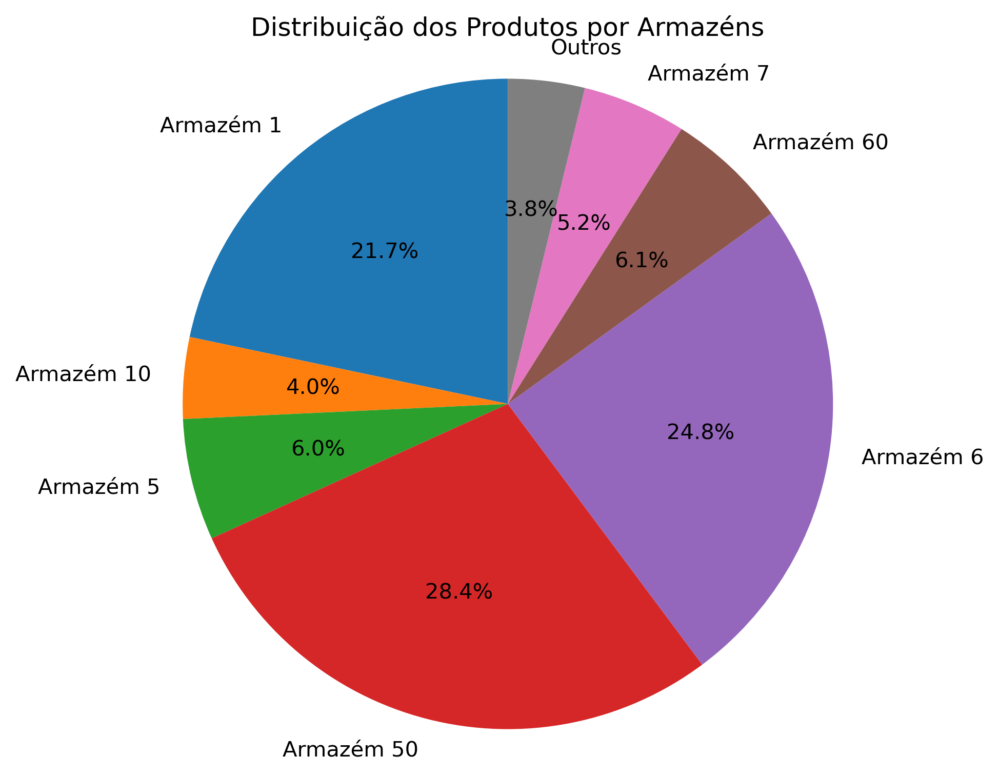
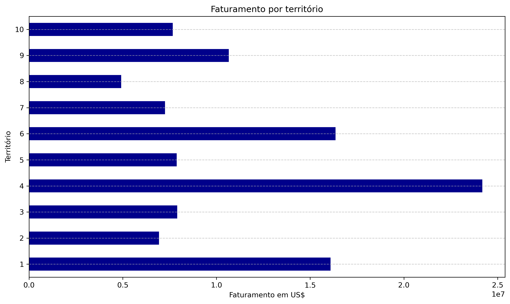
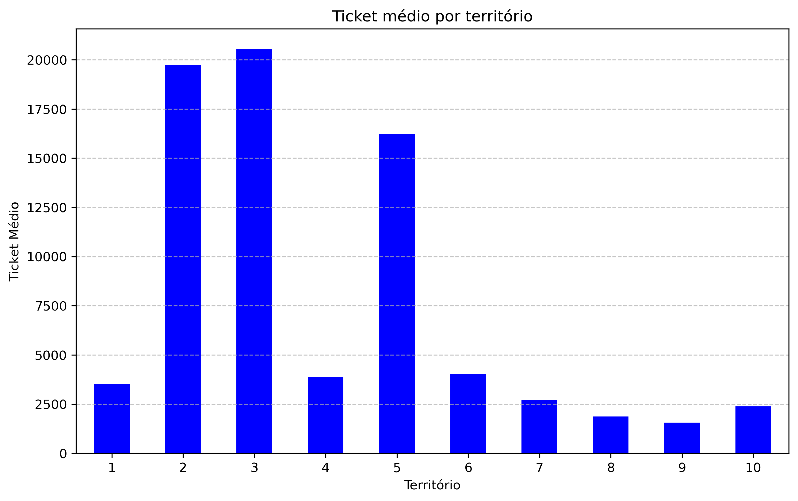
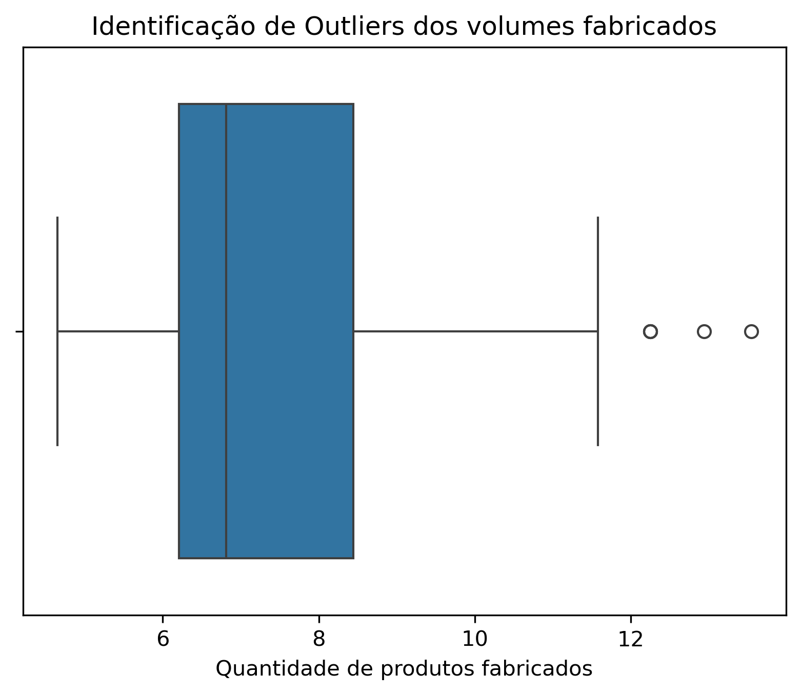
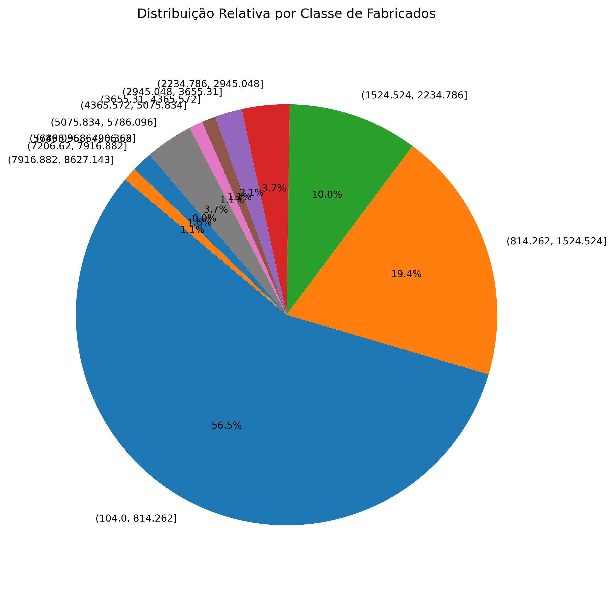
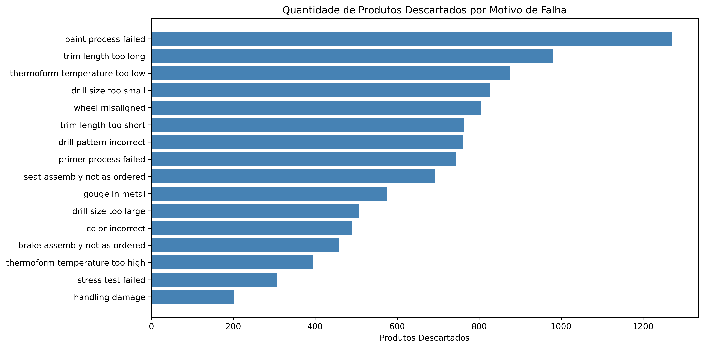
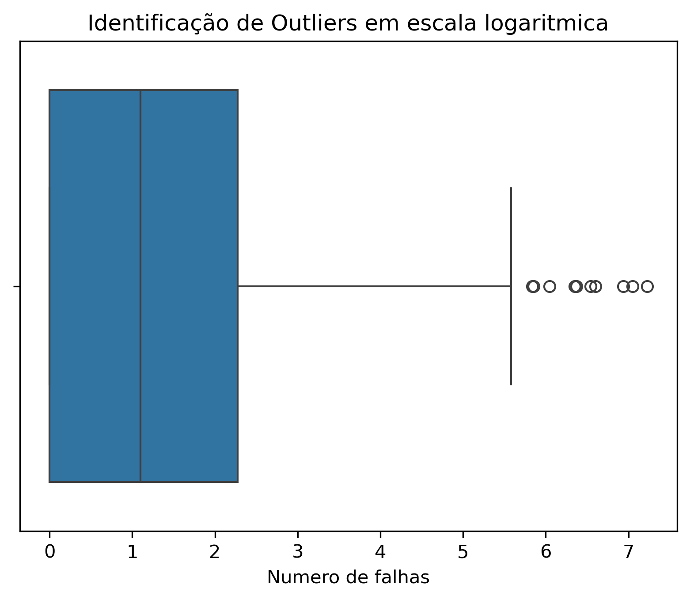
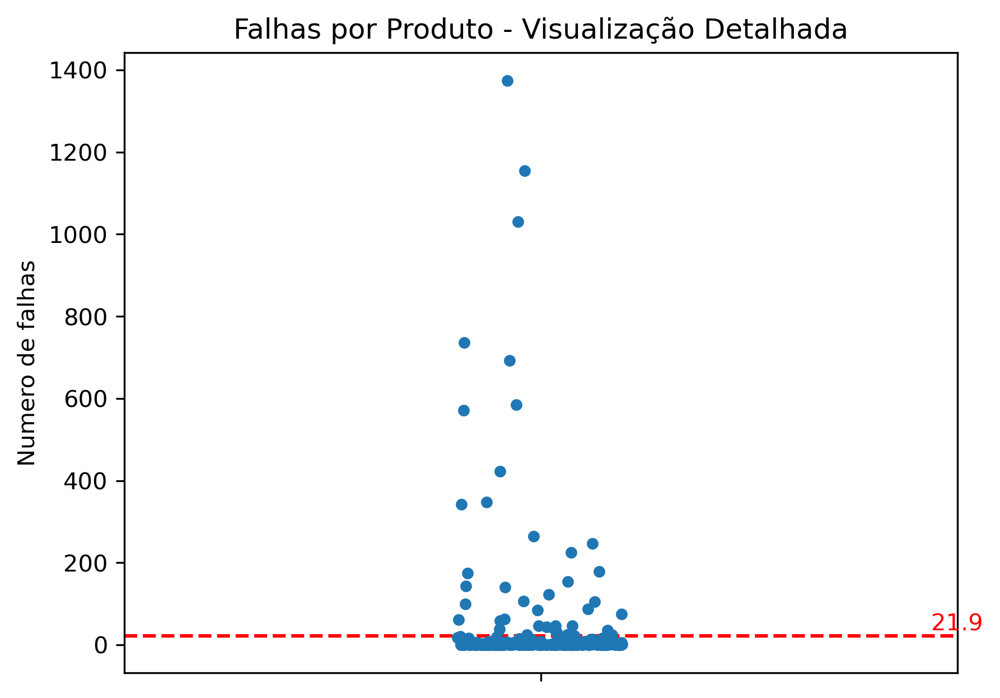
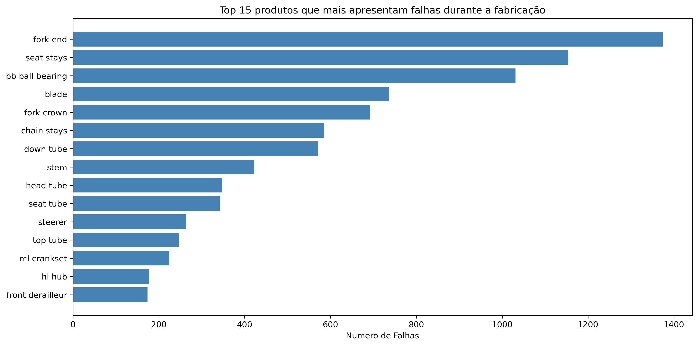

# Análise de Dados de **Gestão de Estoque** e **Produção** - Simulação Empresa B2B e B2C do ramo de Bicicletas e Acessórios

# 📊 Análise de Dados com AdventureWorks 2017 (SQL + Python)

Este projeto apresenta uma análise exploratória de dados realizada com base no banco de dados **AdventureWorks 2017**, um banco relacional de exemplo amplamente utilizado para fins de estudo e demonstração de recursos de BI e bancos SQL.
Utilizando **consultas SQL (SSMS)** integradas ao **Python**, a análise tem como foco investigar **o desempenho dos estoques da empresa**, **o desempenho em vendas por localidades**, bem como **o desempenho da produção de produtos**, incluindo **a identificação e análise de falhas de produção**.

---

## 🎯 Objetivos da análise

- Avaliar o desempenho dos estoques da empresa (nível de estoque e distribuição de produtos em estoques).
- Avaliar o desempenho em vendas baseadas em localidades.
- Analisar o desempenho da produção de produtos ao longo do tempo.
- Identificar padrões e possíveis falhas no processo de produção.
- Gerar insights para possíveis melhorias no processo produtivo.

---

## 🔧 Tecnologias utilizadas

- **Python**
- **SQL Server Management Studio (SSMS)**
- **AdventureWorks 2017** (banco de dados)
- **Pandas**
- **NumPy**
- **Seaborn**
- **Matplotlib**

---

## 📁 Organização do projeto

- `Pojeto_fabrica.ipynb`: Notebook Jupyter contendo o passo a passo da análise, incluindo as queries SQL.
- `requirements.txt`: Lista das bibliotecas Python utilizadas no projeto.
- `data`: Banco de dados e arquivos utilizados para a extração.
- `imagens`: Imagens geradas a partir das análises dos dados.

---
## 📌 Índice

- [1. Análise de Nível de Estoque](#1-análise-de-nível-de-estoque)
- [2. Identificação dos Estoques e seus Níveis](#2-identificação-dos-estoques-e-seus-níveis)
- [3. Avaliação de Vendas por Território](#3-avaliação-de-vendas-por-território)
- [4. Verificação do tempo médio de produção por produto](#4-verificação-do-tempo-médio-de-produção-por-produto)
- [5. Verificação dos produtos mais fabricados](#5-verificação-dos-produtos-mais-fabricados)
- [6. Principais motivos de falhas na produção](#6-principais-motivos-de-falhas-na-produção)
- [7. Principais produtos que mais apresentam falhas na produção](#7-principais-produtos-que-mais-apresentam-falhas-na-produção)
- [Conclusões Gerais](#conclusões-gerais)

---

## 1. Análise de **Nível de Estoque**
**Objetivo**: Fornecer informações para decisões de negócios relacionados ao aumento e a redução da produção de determinados produtos.

**Resultado**: O gráfico para a análise apresentou uma disposição com uma assimetria levemente positiva. Alguns produtos se mostram com o estoque mais alto que a média, porém a distorção é baixíssima. O aumento de estoque de alguns produtos pode indicar uma redução da rotatividade dos produtos, a identificação de produtos sazonais, ou estratégicos. A ausencia de certos produtos em estoque pode indicar a alta rotatividade, falhas na produção ou que o produto saiu da linha de produção.

---

## 2. Identificação dos **Estoques e seus Níveis**
**Objetivo**: Comparar os níveis de diferentes estoques para tornar acertivas as decisões logísticas e processos.

**Resultados**: Após a análise do gráfico, nota-se que cerca de 75% dos produtos armazenados apresentam-se em 3 armazéns principais: Armazém 50, Armazém 6 e Armazém 1. A concentração do armazenamento dos produtos em apenas 3 estoques pode ocasionar um gargalo operacional através da inoperância de algum deles. A Solução seria reavaliar a logística para descobrir se há a possibilidade de redistribuição do estoque. Além de verificar se em uma possível inoperação dos principais armazéns, os outros apresentariam capacidade para suprir as demandas gerais. Outra saída seria avaliar o que diferencia esses 3 armazéns principais em questão de processos e infraestrutura para replicar nos outros armazéns e criar planos de contingência.

---

## 3. Avaliação de **Vendas por Território**
**Objetivo**: Analisar territórios por volumes de vendas, faturamento e ticket médio.

**Resultado**: Podemos observar no primeiro gráfico que os territórios que apresentam os maiores volumes de pedidos são os território 9, 4 e 1. Observamos também que os territórios que apresentam os menores volumes de pedidos são os territórios 5,3 e 2. Quando analisa-se o segundo gráfico percebemos que apesar dos territórios 5,3 e 4 apresentarem um volume de pedidos baixo, seu faturamento se equivale aos outros territórios com exceção dos 3 principais. Porém quando visualizamos o último grafico relacionado ao ticket médio por região, as 3 regiões que antes apresentavam os menores volumes de pedidos, apresentam agora os maiores valores em ticket médio. Isso poderia ser explicado pela provavel compra de produtos com alto valor unitário. Já os territórios 9 e 4, que apresentaram altíssimos volumes de compra, mostram-se com o ticket médio muito baixo, demonstrando possíevis clientes de volume.

**Insights*: 
Os territórios 5,3 e 2 podem apresentar um possível mercado *"premium"** não explorado. Atendimento personalizado, campanhas de marketing e ofertas exclusivas podem aumentar o volume de compras, mantendo a qualidade.
Já nos territórios que apresentaram maiores volumes de compras com baixo ticket médio, a utilização do metodo up-sell/cross-sell, pode ser bem útil.

---

## 4. Verificação do tempo médio de produção por produto
**Objetivo**: Avaliar a eficiência e facilitar o planejamento logístico

**Resultados**: Inicialmente são 238 tipos de produtos produzidos, em que apresentam um tempo máximo de produção de 17 dias e mínimo de 10 dias. O tempo médio geral de produção é de 13 dias e 6 horas. Foi detectado um coeficiente de variação do tempo médio de 19,25%, que significa que o processo de produção apresenta uma eficiência razoável, mantendo uma certa previsibilidade e planejamento operacional.

---

## 5. Verificação dos produtos mais fabricados
**Objetivo**: Análise da consistência da produção em relação ao volume de produtos produzidos

**Resultado**: Os dados apresentaram uma grande assimetria positiva com vários outliers presentes na cauda à direita. Isso nos informa sobre a maioria dos produtos produzidos estarem em faixas baixas, apesar de existirem valores extremos que distorcem a média. Essa assimetria exagerada pode indicar problemas de inconsistências na produção, gargalos ou até produtos chave para a empresa. Mais de 56% dos produtos fabricados possuem um volume de fabricação entre 104 e 814 unidades, seguido de 19% entre 814 e 1524 unidades, estando entre os menores volumes de produção da empresa.
Esse dado pode indicar um portfolio de produtos sem padronização ou muito diverso, o que reduz a eficiência produtiva a partir da criação de várias linhas de produção para pequenas quantidades de produtos. Também pode indicar a ociosidade de recursos incluindo de pessoal, maquinário e/ou tempo. Para os produtos que apresentaram baixa saída, uma solução seria interromper a produção desses produtos específicos ou reformular suas versões.

*Durante a identificação dos Outliers se fez necessária a reformulação dos dados para escala logarítmica para melhor visualização*

---

## 6. Principais motivos de falhas na produção
**Objetivo**: Detectar os principais motivos de falhas durante a produção dos produtos para reduzir custos e aumentar a eficiência da produção.

**Resultados**: A falha que gera o maior número de descartes para a empresa é a que ocorre durante o **processo de pintura**. Há a possibilidade de ser um processo muito comum em vários tipos de produção, mas também há a possibilidade de algum erro mecânico, humano ou nos produtos utilizados durante a pintura.
Soluções possiveis para esses problemas: realizar testes com as tintas utilizadas, melhorar a capacitação dos funcionários e realizar a manutenção frequênte da maquinaria a fim de reduzir perdas futuras.

---

## 7. Principais produtos que mais apresentam falhas na produção
**Objetivo**: Analisar as consistências de falhas a fim de aumentar a eficiência da produção.

**Resultados**: Durante a análise de simetria do gráfico, notou-se a skewness muito elevada, indicando uma distribuição com assimetria positiva e uma cauda muito relevante. Além disso, foi possível detectar a presença de inúmeros outliers que deslocavam a posição original da média. Após a aferição do Coeficiente de variação(CV), tando dos dados gerais, quanto dos dados sem outliers, notou-se extrema alteração na distribuição dos valores de falhas. Os valores extremos do CV indicam uma grande dispersão da distribuição das falhas durante a produção. Isso indica uma baixa previsibilidade no processo de produção e que certos produtos vem apresentando falhas frequêntes ao longo do processo. Seria necessário avaliar quais contextos levam às falhas encontradas. Dentre as possíveis soluções teríamos: reavaliar os processos de produção, incluindo maquinário e pessoal, além de reavaliar a necessidade e o impacto que a interrupção da produção de determinados produtos causaria.

*Durante a identificação dos Outliers se fez necessária a reformulação dos dados para escala logarítmica para melhor visualização*

*Dispersão das falhas por produtos em IQR, marca do limite inferior usada como comparativo*

---

## 8. Conclusões Gerais
A análise de setores relacionados à **Gestão de Estoque** e **Produção** da empresa revelou pontos importantes que podem ajudar na tomada de decisões. Foi possível identificar produtos com altos e baixos níveis de estoque, possíveis gargalos logísticos nos armazéns, e diferenças no desempenho de vendas entre os territórios. Além disso, os dados de produção mostraram variações no volume fabricado e na quantidade de falhas, destacando a etapa de pintura como a mais crítica. Essas informações podem ser úteis para melhorar a logística, otimizar a produção e reduzir perdas, contribuindo para uma gestão mais eficiente.
